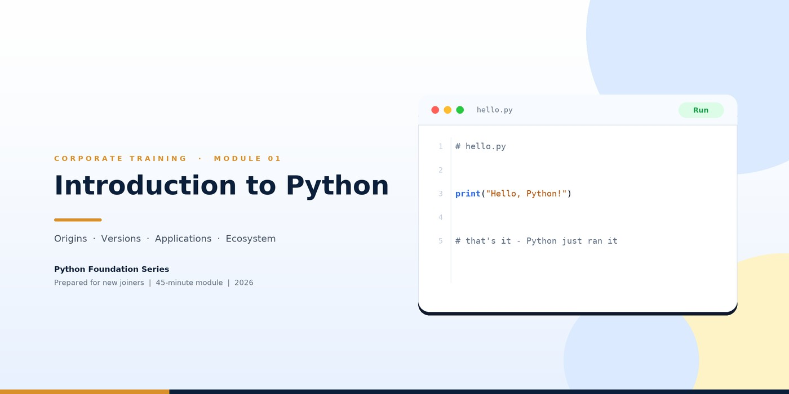
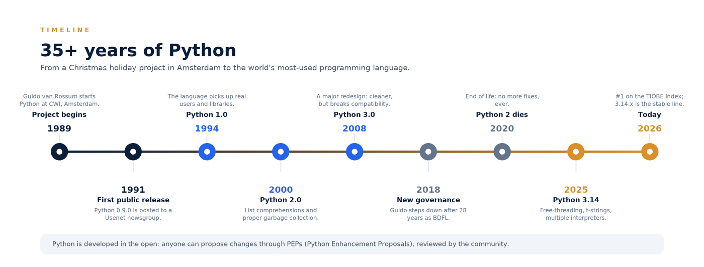
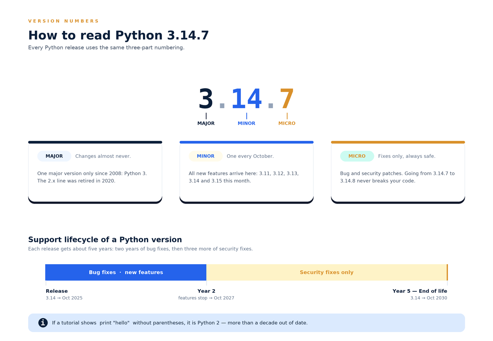
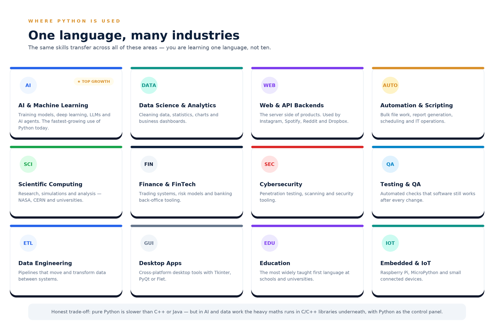
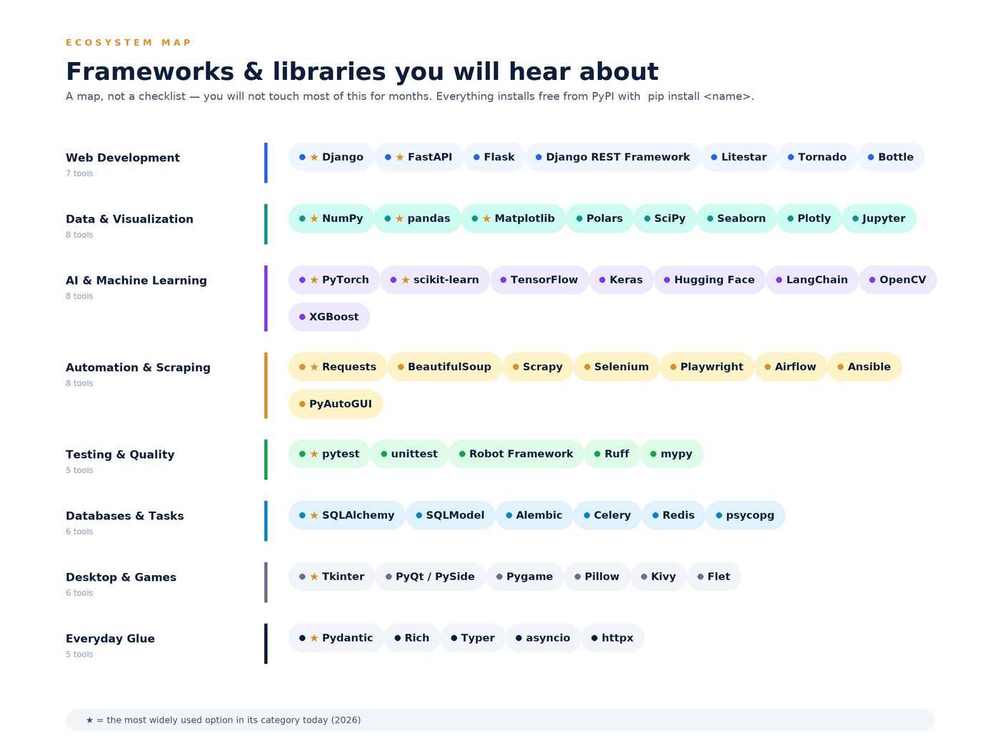
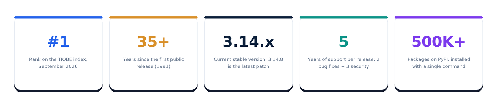
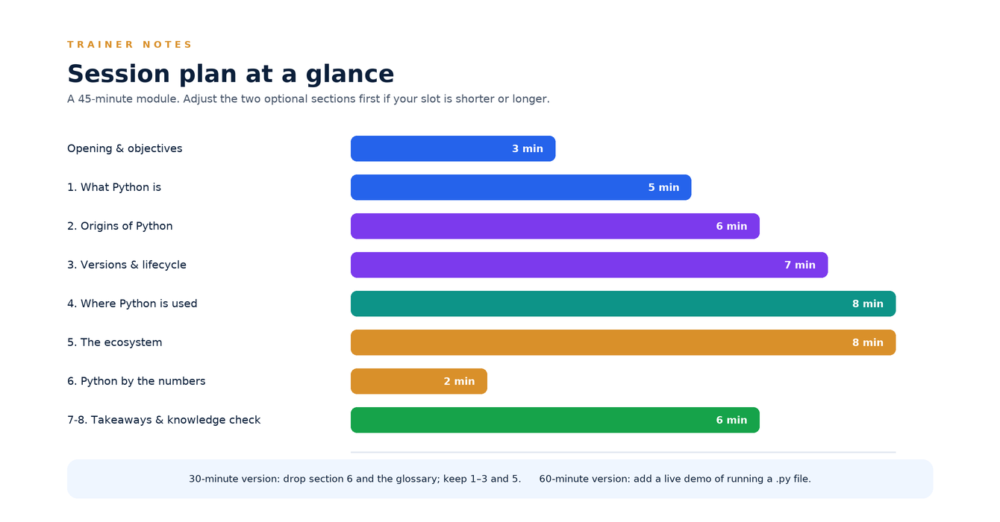

# Module 01 — Introduction to Python

| Field | Detail |
|---|---|
| **Programme** | Python Foundation Series |
| **Module** | 01 — Introduction to Python |
| **Audience** | New joiners / freshers (no prior coding experience assumed) |
| **Duration** | 45 minutes (30 min walkthrough + 15 min discussion) |
| **Prerequisites** | None |
| **Version basis** | Python 3.14 (current stable line, October 2026) |
| **Trainer notes** | Appendix A |
| **Status** | Published — v1.0 (October 2026) |

---

## Learning objectives

By the end of this module, participants will be able to:

1. Describe what Python is and why it is used across the industry.
2. Explain the origin of the language — who, when, where and why.
3. Read a Python version number correctly (`3.14.7`) and explain the support lifecycle.
4. Identify the major application areas of Python in the enterprise.
5. Recognise the most widely used frameworks and libraries, and know where to find them.

---

## 1. What Python is

> **Python is a high-level, general-purpose, interpreted programming language designed for readability.**

| Characteristic | What it means for you |
|---|---|
| **High-level** | Memory addresses and CPU instructions are hidden — you write logic, not machine detail. |
| **General-purpose** | Not limited to one domain. Websites, data, automation and AI are all the same language. |
| **Interpreted** | Code runs line by line through the interpreter — no separate compile step. Fast edit → run → refine. |
| **Dynamically typed** | You declare values, not types. Python infers the type at runtime. |
| **Readable** | Syntax was designed to look close to English. It is often called *executable pseudocode*. |
| **Free and open source** | Governed by the non-profit Python Software Foundation, developed in the open. |
| **Cross-platform** | The same code runs on Windows, macOS and Linux without changes. |

**Why organisations choose it:** a single language covers backend services, data pipelines, automation, testing and AI — which reduces the number of tools a team has to master and hire for.

---

## 2. Origins of Python

| Question | Answer |
|---|---|
| **Who** | **Guido van Rossum**, a Dutch programmer |
| **When** | **December 1989** — started as a holiday project |
| **Where** | **CWI** (Centrum Wiskunde & Informatica), Amsterdam, Netherlands |
| **Why** | He wanted a language with the readability of the teaching language **ABC**, but with real-world power: proper error handling, operating-system access and extensibility. |

**Where the name comes from:** *Monty Python's Flying Circus*, the British comedy series — not the snake. The snake logo came later, as a visual pun.

### Milestones

| Year | Event |
|---|---|
| **1989** | Guido van Rossum begins work at CWI, Amsterdam. |
| **1991** | Python 0.9.0 — first public release, posted to a Usenet newsgroup. |
| **1994** | Python 1.0 — the language gains real users and libraries. |
| **2000** | Python 2.0 — list comprehensions, proper garbage collection. |
| **2001** | Python Software Foundation formed to hold the copyright and guide the project. |
| **2008** | Python 3.0 — a major redesign; cleaner, but breaks backwards compatibility. |
| **2018** | Guido steps down as **BDFL** after 28 years. An elected five-person **Steering Council** takes over. |
| **2020** | **Python 2 reaches end of life** — no further fixes, ever. |
| **2025** | Python 3.14 — free-threading, t-strings, multiple interpreters. |
| **2026** | **#1 on the TIOBE index.** Python 3.14.x is the stable line. |

> **How Python changes today:** anyone can propose an improvement through a **PEP (Python Enhancement Proposal)** — a public, documented design process reviewed by the community. Python is not controlled by a single vendor.

---

## 3. Versions and the support lifecycle

### The numbering convention

`Python 3.14.7` is read as three parts:

| Part | Value today | Meaning |
|---|---|---|
| **Major** | `3` | Rarely changes. Python 3 has been the only line since 2008. |
| **Minor** | `14` | New versions ship **every October** and carry all new features. |
| **Micro** | `7` | Bug and security fixes only. Always safe to upgrade. |

### Release cadence

| Version | Released | Status (Oct 2026) |
|---|---|---|
| **3.14** | Oct 2025 | **Current stable line** — recommended for all new work. Latest patch: 3.14.8 |
| 3.13 | Oct 2024 | Supported (bug fixes end Oct 2026) |
| 3.12 | Oct 2023 | Supported — security fixes only |
| 3.11 | Oct 2022 | Supported — security fixes only |
| 3.10 | Oct 2021 | **Support ends 31 Oct 2026** |
| 2.7 and below | — | End of life since 1 Jan 2020. Do not use. |

Each release receives roughly **five years of support**: about two years of bug fixes, then three years of security fixes. Python 3.14 is supported until **October 2030**.

> **⚠ Watch out for old tutorials.** If material shows `print "hello"` without parentheses, it is **Python 2** — more than a decade out of date. Always check for Python 3 syntax.

---

## 4. Where Python is used in industry

| Domain | Typical work |
|---|---|
| **AI & Machine Learning** | Training models, deep learning, LLM and AI-agent applications. The fastest-growing area today. |
| **Data Science & Analytics** | Data cleaning, statistics, visualisation and business dashboards. |
| **Web & API Backends** | Server-side logic for products. Used by Instagram, Spotify, Reddit and Dropbox. |
| **Automation & Scripting** | Bulk file processing, report generation, scheduling, IT operations. |
| **Scientific Computing** | Research, simulation and analysis — NASA, CERN and universities. |
| **Finance & FinTech** | Trading systems, risk modelling and back-office tooling. |
| **Cybersecurity** | Penetration testing, scanning and security tooling. |
| **Testing & QA** | Automated regression checks for every release. |
| **Data Engineering** | Pipelines that move and transform data between systems. |
| **Desktop Applications** | Cross-platform internal tools. |
| **Education** | The most widely taught first language worldwide. |
| **Embedded & IoT** | Raspberry Pi, MicroPython and connected devices. |

> **An honest trade-off to know.** Pure Python is slower than compiled languages such as C++ or Java. In practice this rarely matters, because in data and AI work the heavy computation runs inside C/C++/GPU libraries, with Python acting as the control panel.

---

## 5. The ecosystem: frameworks and libraries

**Vocabulary first**

| Term | Meaning |
|---|---|
| **Library** | Reusable code that you call from your own program. |
| **Framework** | A more opinionated structure that calls *your* code and defines how the application is organised. |
| **PyPI** | The Python Package Index — the public repository of packages, installed with `pip install <name>`. |

| Category | Most-used tools today |
|---|---|
| **Web development** | Django (full-stack), FastAPI (modern APIs — now the leading choice for new projects), Flask (lightweight), Django REST Framework |
| **Data & visualisation** | NumPy, pandas, Matplotlib, Polars, SciPy, Seaborn, Plotly, Jupyter |
| **AI & machine learning** | PyTorch, scikit-learn, TensorFlow, Keras, Hugging Face, LangChain, OpenCV, XGBoost |
| **Automation & scraping** | Requests, BeautifulSoup, Scrapy, Selenium, Playwright, Airflow, Ansible |
| **Testing & quality** | pytest, unittest, Robot Framework, Ruff, mypy |
| **Databases & task queues** | SQLAlchemy, SQLModel, Alembic, Celery, Redis, psycopg |
| **Desktop & games** | Tkinter, PyQt / PySide, Pygame, Pillow, Kivy, Flet |
| **Everyday utilities** | Pydantic, Rich, Typer, asyncio, httpx |

> **Read this as a map, not a checklist.** Nothing here is required on day one. The first months are core language skills — variables, loops, functions — after which frameworks become straightforward.

*Adoption note: in the most recent developer surveys Django leads overall enterprise usage, while FastAPI is the fastest-growing and the default choice for new API projects.*

---

## 6. Python by the numbers

| Metric | Value |
|---|---|
| TIOBE index | **#1** language, September 2026 |
| First public release | 1991 — 35+ years of continuous development |
| Current stable version | **3.14.x** (3.14.8 latest patch) |
| Support per release | ~5 years (2 bug fixes + 3 security) |
| Packages available | 500,000+ on PyPI |
| Governance | Python Software Foundation + elected Steering Council |

*TIOBE ratings are now at 17.76% — Python’s **highest position since the index began in 2001**.*

---

## 7. Key takeaways

1. Python is a **readable, general-purpose, interpreted** language — one language for web, data, automation, testing and AI.
2. It was created by **Guido van Rossum in December 1989 at CWI, Amsterdam**, and released publicly in **1991**.
3. Version numbers read as **major.minor.micro** — `3.14.7`. Minor versions ship **every October**; micro versions are safe fixes.
4. **Python 3.14.x is the version to learn today.** Python 2 has been unsupported since 2020.
5. Python’s strength is its **ecosystem**: a small core language plus an enormous, well-maintained set of libraries.
6. You do **not** need to learn the ecosystem up front — a solid grasp of core Python unlocks all of it.

---

## 8. Knowledge check

1. Who created Python, in which year did the work begin, and in which city?
2. What does each part of `3.14.7` mean?
3. How many years of support does a Python release receive, and how is it split?
4. Name three industries where Python is used, with one example each.
5. Which framework is the current default choice for building new APIs, and which is the best-known full-stack framework?
6. Why does Python being “slower than C++” not usually matter in data and AI work?

Answers

1. Guido van Rossum; December 1989; Amsterdam (CWI).
2. `3` major (rarely changes), `14` minor (annual feature release), `7` micro (bug/security fixes only).
3. About five years — roughly two years of bug fixes followed by three years of security fixes.
4. Any three of: AI/ML, data science, web backends, automation, scientific computing, finance, cybersecurity, QA, data engineering, desktop, education, IoT.
5. **FastAPI** for new APIs; **Django** is the best-known full-stack framework.
6. The heavy computation runs in optimised C/C++/GPU libraries underneath — Python orchestrates them.

---

## 9. Glossary

| Term | Definition |
|---|---|
| **Interpreter** | The program that executes Python code line by line. |
| **PyPI** | Python Package Index — the public package repository. |
| **pip** | The standard tool for installing packages from PyPI. |
| **PEP** | Python Enhancement Proposal — the public process for proposing language changes. |
| **BDFL** | “Benevolent Dictator For Life” — Guido van Rossum’s title until 2018. |
| **PSF** | Python Software Foundation — the non-profit that owns and governs Python. |
| **Framework** | A structured foundation that calls your code and defines application layout. |
| **Library** | A collection of reusable functions that your code calls. |
| **LTS-style support** | Long support window (≈5 years) as described in section 3. |
| **EOL** | End of life — no further fixes or security patches. |

---

## 10. References

- Python downloads and release status — [python.org/downloads](https://www.python.org/downloads/)
- Python release lifecycle (PEP 745 for 3.14) — [python.org](https://www.python.org/downloads/)
- TIOBE Index, September 2026 — Python #1 — [tiobe.com/tiobe-index/python](https://www.tiobe.com/tiobe-index/python/)
- Framework adoption — JetBrains Python Developers Survey; Stack Overflow Developer Survey
- Python history and governance — [Python Software Foundation](https://www.python.org/psf/)

---

# Appendix A — Trainer notes

## A1. Session plan

| # | Segment | Time | Running | Material |
|---|---|---|---|---|
| — | Opening & objectives | 3 min | 0:03 | Title card |
| 1 | What Python is | 5 min | 0:08 | Section 1 |
| 2 | Origins of Python | 6 min | 0:14 | Timeline figure |
| 3 | Versions & the support lifecycle | 7 min | 0:21 | Version anatomy figure |
| 4 | Where Python is used | 8 min | 0:29 | Applications grid |
| 5 | The ecosystem | 8 min | 0:37 | Ecosystem map |
| 6 | Python by the numbers *(optional)* | 2 min | 0:39 | KPI strip |
| 7 | Key takeaways | 3 min | 0:42 | Section 7 |
| 8 | Knowledge check | 3 min | 0:45 | Section 8 + answers |

## A2. Talking points by section

### Opening — 3 min
- **Frame the value, not the technology:** *"In 45 minutes you will be able to follow a Python conversation in a stand-up, and you will know which parts of the platform we are talking about."*
- Calibrate the room with a show of hands: *"Who has written any code before? Who has written Python?"* If most hands go up, compress section 1 and give the time to sections 3 and 5.
- Set the boundary: no coding today. Module 2 is where participants install Python and run their first program.
- Call out the version basis on screen: **everything in this deck is Python 3.14** (October 2026).

### Section 1 — What Python is — 5 min
- **Key message:** *one readable language that covers web, data, automation, testing and AI.*
- Use the phrase **"executable pseudocode"** — it lands well with non-programmers.
- Analogy for **interpreted**: a conversation rather than a printed book. You speak a line, you hear the answer, you adjust. That fast loop is why Python is the default language for experimentation.
- Say explicitly: **no compilation step, no declaring types** — this removes half the fear beginners bring from other languages.
- **Watch for:** participants asking "is it fast enough?" Park it and answer it in section 4's trade-off callout.

### Section 2 — Origins of Python — 6 min
- **Key message:** Python was a *personal* project that solved a real frustration, and it is still developed in the open.
- Tell the story in one breath: Guido van Rossum, December 1989, CWI Amsterdam, Christmas holiday, building on lessons from the ABC language.
- The **Monty Python name origin** is the memorable hook — use it, and mention the snake logo came later as a pun.
- **2018 governance:** Python is the rare language with no single owner. The elected five-person Steering Council is a good moment to mention that contributions are open to anyone — including the people in the room.
- **Watch for:** "So is Python 2 still used?" Answer plainly: support ended on 1 January 2020; anything still running it is a legacy risk, and that is a common audit finding.

### Section 3 — Versions & the support lifecycle — 7 min
- **Key message:** version literacy prevents real production mistakes.
- Walk **`3.14.7`** digit by digit, then add the one rule everyone must remember: **micro upgrades are safe; minor upgrades may change behaviour.**
- Emphasise the **support window** — about five years, roughly two of bug fixes and three of security fixes. Tie it to planning: a service on 3.10 needs a migration plan this quarter.
- **Trap to highlight (verbatim):** *"If a tutorial shows `print "hello"` without brackets, it is Python 2. Close the tab."* This is the single most common way freshers lose a day.
- **Ask the room:** *"Which of our services would go out of support this year?"* — makes the topic concrete.

### Section 4 — Where Python is used — 8 min
- **Key message:** the skills transfer; the room is not learning ten different things.
- Do not read the grid aloud. Instead, ask participants to **pick the two areas most relevant to their team**, then talk about those two in detail.
- Use the **named products** (Instagram, Spotify, Reddit, Dropbox) to make backends tangible, and NASA/CERN for scientific computing.
- Deliver the **trade-off honestly**: pure Python is slower than C++ or Java; in data and AI the heavy maths runs in C/C++/GPU libraries underneath. Being upfront about this builds credibility with sceptical senior engineers.
- **Watch for:** "Will AI replace Python?" Reframe: AI tooling is *written in* Python; it increases demand for people who can read and integrate it.

### Section 5 — The ecosystem — 8 min
- **Key message:** the ecosystem is a map, not a syllabus. Nobody is expected to know it on day one.
- Give the vocabulary first — **library vs framework** — using the "you call it / it calls you" distinction. This single sentence prevents months of confusion.
- Name only the three web frameworks in depth: **Django** (full-stack), **FastAPI** (modern APIs, fastest-growing), **Flask** (lightweight). Mention the rest as categories.
- **Reassure explicitly:** the first months are core language only. Frameworks become easy once variables, loops and functions are solid.
- **Watch for:** the room trying to memorise the chip list. Tell them the figure is in the handout and will be revisited in a later module.

### Section 6 — Python by the numbers — 2 min *(optional)*
- Use this as a **breather and a credibility moment**, not a data-dump. Read the first two KPIs aloud; let the rest sit on screen.
- If the session is running long, this section and the glossary are the first things to drop.

### Section 7 — Key takeaways — 3 min
- Ask participants to **read the six takeaways themselves** and pick one they did not know at the start.
- Close with the forward link: *"Next session we install Python and run our first program — bring your laptop."*

### Section 8 — Knowledge check — 3 min
- Run it as **open discussion, not a test.** Ask the question, wait five seconds, then take any answer.
- Question 3 (support lifecycle) and question 5 (framework names) are the two to insist on — they are the ones used in real project conversations.
- Answers are in the collapsible block in section 8 of the handout.

## A3. Facilitation tips

| Situation | Suggested handling |
|---|---|
| Mixed experience in the room | Pair an experienced joiner with a beginner for the knowledge check. |
| Silence after a question | Ask for a show of hands or a one-word answer first; open questions land better once the room has spoken. |
| Deep technical question early | Park it on a visible list and answer it in the section it belongs to, or after the session. |
| Strong sceptic in the room | Go to the trade-off callout in section 4 and the governance point in section 2 — both signal honesty. |
| Running long | Drop section 6, then the glossary, then shorten section 4 to AI and the team's own domain. |
| Running short | Add the Ecosystem map walkthrough tool-by-tool, or demo running a `.py` file. |

## A4. Questions to expect (with ready answers)

| Question | Answer |
|---|---|
| Is Python slow? | For most business workloads the bottleneck is the database or the network, not the language. Where it matters, performance-critical work is done by C/C++/GPU libraries, or the service is scaled horizontally. |
| Why not Java / C# / Node? | For this workstream the deciding factor is the ecosystem — data, AI and automation libraries are Python-first. That is a hiring and delivery advantage. |
| Which version should we standardise on? | **3.14.x** for new services; existing services should follow the support table in section 3 and plan migrations before end of support. |
| Do we need to learn frameworks on day one? | No. Core language first. The ecosystem map is for recognition, not memorisation. |
| Is Python 2 still a risk? | Yes — it has been unsupported since 2020 and receives no security fixes. Any Python 2 code in production is a finding worth raising. |
| Is Python free for commercial use? | Yes. It is open source under a permissive licence, governed by the Python Software Foundation. There are no licence fees. |

## A5. Materials and pre-work

- **Facilitator:** the module document, the six figures (projected), a whiteboard for the parked-questions list.
- **Participants:** no pre-work required. Laptop optional for this module; required from Module 2 onward.
- **Ongoing:** the ecosystem map (section 5) is the reference most likely to be revisited — keep it in the shared drive.

---

*End of Module 01. Next: Module 02 — installing Python and running your first program.*
