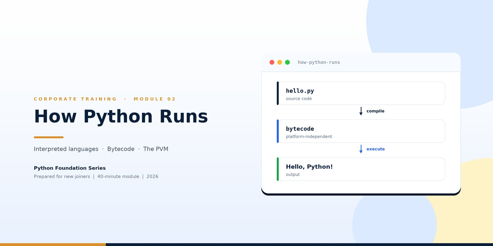
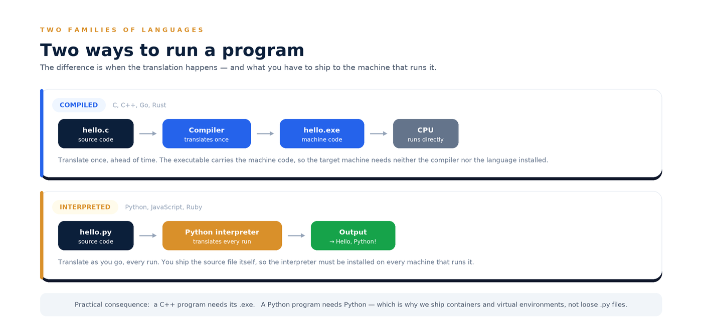
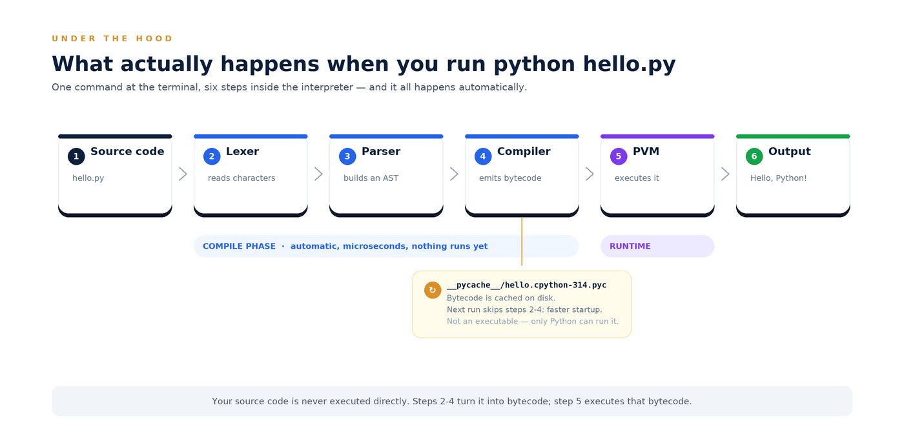
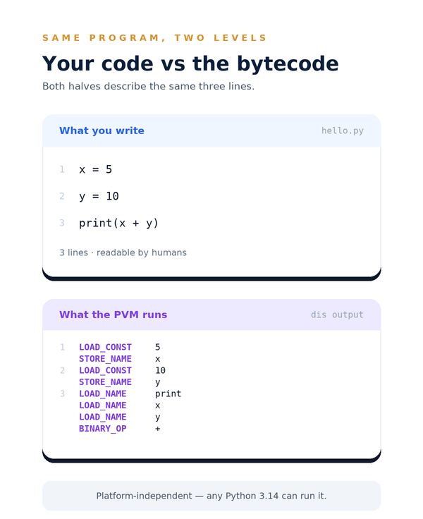
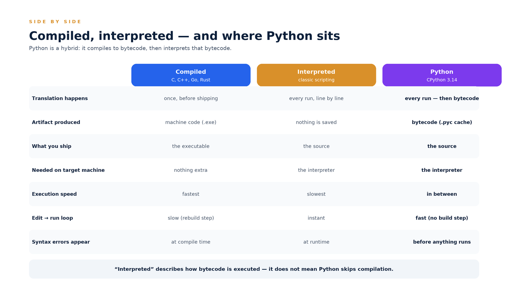
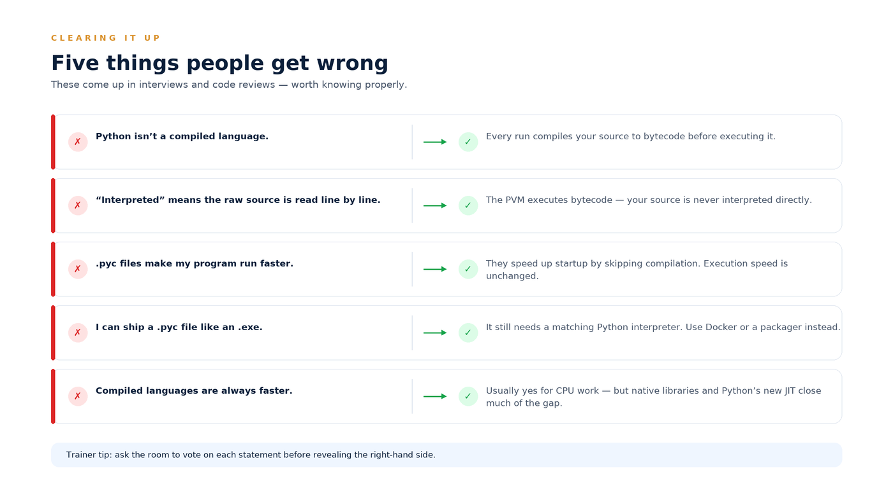
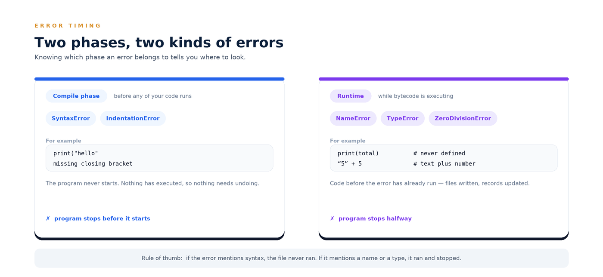
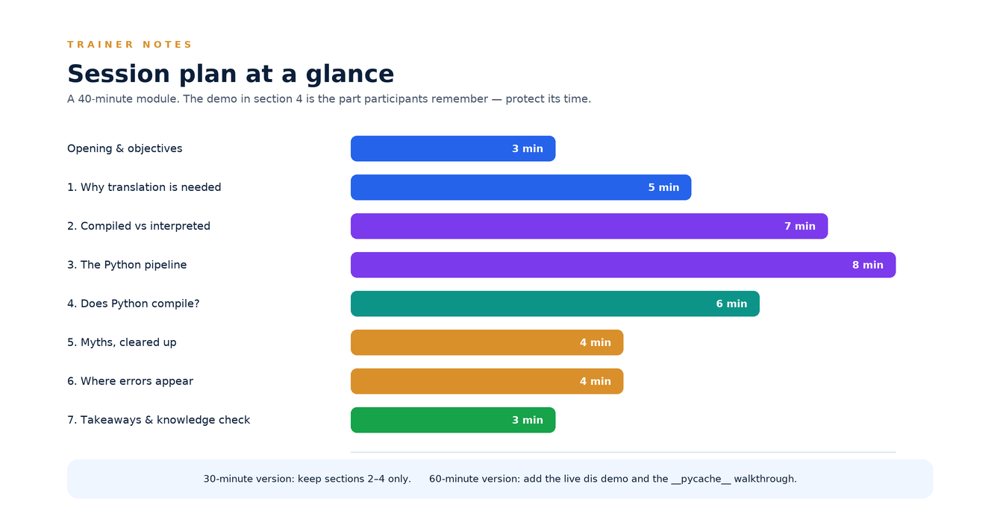

# Module 02 — How Python Runs

| Field | Detail |
|---|---|
| **Programme** | Python Foundation Series |
| **Module** | 02 — How Python Runs (interpreted languages, bytecode and the PVM) |
| **Audience** | New joiners / freshers who have completed Module 01 |
| **Duration** | 40 minutes (30 min walkthrough + 10 min discussion) |
| **Prerequisites** | Module 01 — Introduction to Python |
| **Version basis** | CPython 3.14 (current stable line, October 2026) |
| **Trainer notes** | Appendix A |
| **Status** | Published — v1.0 (October 2026) |

---

## Learning objectives

By the end of this module, participants will be able to:

1. Explain what *interpreted* actually means, using the compiled-vs-interpreted distinction.
2. Describe the six steps between `python hello.py` and the output on screen.
3. Answer the question **"does Python compile?"** precisely, and explain what bytecode is.
4. Recognise a `.pyc` file and the `__pycache__` folder, and state what they do — and do not — make faster.
5. Tell a compile-phase error (`SyntaxError`) from a runtime error (`NameError`), and what each implies.

> **Why this module matters.** "Python is interpreted" is repeated so often that most
> beginners believe the interpreter reads their source code line by line. It does not.
> Getting this right makes later topics — imports, caching, virtual environments,
> containers, performance, even Python's new JIT — feel obvious instead of mysterious.

---

## 1. The problem every language must solve

Computers execute **machine code** — binary instructions that are specific to a CPU
architecture. Humans write in a language with words, indentation and meaning. Somewhere,
that gap has to be crossed.

A processor cannot run `print("Hello")`. Something must translate it — and the design
question for every language is **when** that translation happens:

- **ahead of time**, once, before the program is shipped → *compiled languages*
- **during execution**, every time the program runs → *interpreted languages*

Everything else in this module follows from that one decision.

---

## 2. Compiled vs interpreted



| | **Compiled** | **Classic interpreted** |
|---|---|---|
| **Examples** | C, C++, Go, Rust | scripting languages in the original sense |
| **Translation** | once, before shipping | every run, as the program executes |
| **Artifact** | machine code (`.exe`, `.o`) | nothing persisted |
| **What you ship** | the executable | the source file |
| **Needed on the target machine** | nothing extra | the interpreter |
| **Edit → run loop** | slow: every change needs a rebuild | instant |
| **Speed at runtime** | fastest | slowest |

**The trade in one line:** compiling buys speed at the cost of the fast feedback loop;
interpreting buys flexibility and portability at the cost of raw speed.

**Why this matters in practice.** Because Python ships *source*, not executables, the
interpreter must be present wherever your code runs — on a colleague's laptop, on a
server, inside a container. That single fact is the reason virtual environments, Docker
images and `requirements.txt` exist. Module 1 mentioned them; now you know *why*.

---

## 3. Inside the interpreter: what `python hello.py` really does



Run one command and six things happen, in order, automatically:

| Step | Name | What it does |
|---|---|---|
| 1 | **Source code** | `hello.py` sits on disk as plain text. |
| 2 | **Lexer** | Reads characters and turns them into tokens (`print`, `(`, `"Hello"`, `)`). |
| 3 | **Parser** | Arranges tokens into an **AST** — an abstract syntax tree. This is where `SyntaxError` is raised. |
| 4 | **Compiler** | Walks the tree and emits **bytecode** for the Python Virtual Machine. |
| 5 | **PVM** | The **Python Virtual Machine** executes the bytecode, instruction by instruction. |
| 6 | **Output** | Your text appears on screen. |

Steps 2–4 are the **compile phase**. Step 5 is the **runtime**.

> **The line people miss:** your source code is never executed. It is translated into
> bytecode, and the *bytecode* is what runs.

### Bytecode is not machine code

| | **Bytecode** | **Machine code** |
|---|---|---|
| Produced by | CPython's compiler | a native compiler (gcc, clang) |
| Consumed by | the PVM | the CPU directly |
| Platform | independent — any OS, any CPU | specific to the architecture |
| Can it run on its own? | no — always needs Python | yes — that is the point |

Bytecode is a compact, intermediate instruction set. It is *lower* than your source but
*not* native instructions — think of it as an agreed halfway language between Python and
the machine.

---

## 4. So — does Python compile?

**Yes.** Python compiles. What it does not do is compile to *machine code* ahead of time.

> **CPython is a bytecode compiler plus an interpreter loop.**

Two precise statements worth memorising:

- ✅ *"Python compiles source to bytecode, then interprets that bytecode."* — correct.
- ❌ *"Python is interpreted, so there is no compilation step."* — wrong.

**CPython** is the reference implementation — the interpreter you get from python.org,
and the one almost everyone means when they say "Python". (PyPy and GraalPy are separate
implementations that compile much more aggressively; they are outside this module's scope.)

### See it for yourself — three commands

```bash
# 1. Look at the bytecode the compiler produces
python3 -m dis hello.py
```

```
  0           0 RESUME                   0

  1           2 LOAD_CONST               0 (5)
              4 STORE_NAME               0 (x)

  2           6 LOAD_CONST               1 (10)
              8 STORE_NAME               1 (y)

  3          10 PUSH_NULL
             12 LOAD_NAME                2 (print)
             14 LOAD_NAME                0 (x)
             16 LOAD_NAME                1 (y)
             18 BINARY_OP                0 (+)
             22 PRECALL                  1
             26 CALL                     1
             36 POP_TOP
             38 LOAD_CONST               2 (None)
             40 RETURN_VALUE
```

*Sample output from CPython 3.11; 3.12+ dropped `PRECALL`, so opcode names and
offsets differ slightly across versions — the pattern is identical.*

```bash
# 2. Import a module (not a top-level script) to create the cache
python3 -c "import hello"

# 3. See what Python left on disk
ls __pycache__/
# hello.cpython-314.pyc
```

That `.pyc` file is the compiled bytecode, cached for the next run.

---

## 5. Your code and its bytecode, side by side



### The `__pycache__` folder

When you **import** a module, CPython writes the compiled bytecode into
`__pycache__/<module>.cpython-<version>.pyc`. The filename records the interpreter
version that produced it.

On the next run, Python checks two things:

1. does the `.pyc` match the **interpreter version**?
2. is the **source file unchanged** (timestamp, or a hash if you use hash-based pyc)?

If both match, Python loads the bytecode and **skips the lexer, parser and compiler**.
That is all a `.pyc` does.

> **⚠ The most common misconception in this module.**
> A `.pyc` does **not** make your program *run* faster. It makes it **start** faster,
> because there is less work to do before execution begins. The bytecode inside is
> exactly what would have been produced anyway.

Two practical notes:

- A top-level script run as `python hello.py` is **not** cached. Caching happens for
  **imported** modules — which is why large projects and frameworks notice it most.
- Use `python -B` (or `PYTHONDONTWRITEBYTECODE=1`) to stop Python writing these files —
  useful in read-only containers. It does *not* stop Python reading an existing cache.

---

## 6. Compiled, interpreted — and where Python sits



Python is a **hybrid**, and it lands between the two extremes:

- The **architectural** part — compile to bytecode, then interpret — differs from C only
  in what the compiler emits.
- The **practical** part — you ship source, you need the interpreter on the target
  machine — makes it behave like an interpreted language.

**The honest performance picture.** CPython is slower than C++ or Java for CPU-bound
work, because every bytecode instruction carries interpreter overhead. This rarely
matters in business applications, where the time is spent waiting on databases, networks
and disks, and it matters even less in data and AI work, where the heavy computation runs
in C/C++/GPU native libraries underneath.

---

## 7. Five things people get wrong



1. **"Python isn't a compiled language."**
   Every run compiles your source to bytecode before executing it. It is compiled — just
   not to machine code, and not ahead of time.

2. **"Interpreted means the raw source is read line by line."**
   The PVM executes **bytecode**. Your source is only ever read as an input to the
   compiler.

3. **"`.pyc` files make my program faster."**
   They speed up **startup** by skipping compilation. Execution speed is unchanged.

4. **"I can ship a `.pyc` like an `.exe`."**
   It still needs a matching Python interpreter. Use container images or a packager
   (PyInstaller and similar) when you need something to hand to a non-technical user.

5. **"Compiled languages are always faster."**
   Usually true for CPU-bound work — but native libraries do the heavy lifting inside
   most Python code, and CPython's new JIT narrows the gap on compute-heavy loops.

---

## 8. Where errors appear



Because execution has two phases, errors arrive in two flavours.

| | **Compile phase** | **Runtime** |
|---|---|---|
| **When** | before any of your code runs | while bytecode is executing |
| **Typical errors** | `SyntaxError`, `IndentationError` | `NameError`, `TypeError`, `ZeroDivisionError` |
| **Did anything execute?** | No — not a single line | Yes — everything before the failing line already ran |
| **What it means for data** | nothing to undo | files may be written, records updated |

```python
# Compile phase — the program never starts
print("hello"          # SyntaxError: '(' was never closed
```

```python
# Runtime — line 1 succeeds, line 2 fails
print("starting")      # this runs and prints
print(total)           # NameError: name 'total' is not defined
```

> **Rule of thumb:** if the error is about **syntax**, the file never ran. If it is about
> a **name** or a **type**, the file ran and stopped partway — check what it already did.

This is why careful scripts write to a temporary file and rename at the end, and why
batch jobs are made re-runnable. Section 5 of the trainer notes links this back to work
participants will actually do.

---

## 9. Under the hood: what is changing in 3.14

Worth knowing, so nobody is surprised in a performance conversation.

| Improvement | What it is |
|---|---|
| **Specialising adaptive interpreter** (PEP 659, shipped 3.11) | The PVM observes which types flow through a hot loop and replaces generic instructions with type-specialised ones. Invisible to you — same bytecode semantics. |
| **Experimental JIT** (PEP 744, binaries from 3.14) | The official macOS and Windows builds include an experimental just-in-time compiler that translates hot bytecode to machine code. It is **off by default**, enabled with `PYTHON_JIT=1`, and is *not* recommended for production yet. |
| **Free-threaded build** (PEP 703, officially supported in 3.14) | An optional build with the global interpreter lock (GIL) disabled, so threads can use multiple CPU cores. Opt-in, with its own performance trade-offs. |

> **For this module, one sentence is enough:** Python still compiles to bytecode and
> interprets it, exactly as described above. These projects make the *interpreter* faster;
> they do not change the model. Reported JIT gains on compute-heavy code are roughly
> 10–30% — meaningful, but it remains experimental.

---

## 10. Key takeaways

1. A processor only runs **machine code**; every language must translate, and the design
   choice is **when**.
2. Every run of Python takes **source → tokens → AST → bytecode → PVM → output**.
3. **Yes, Python compiles** — to bytecode, not to machine code. "Interpreted" describes
   how bytecode is executed, not the absence of compilation.
4. `.pyc` files in `__pycache__` speed up **startup** by skipping compilation; they do not
   speed up execution and they are not executables.
5. Because there are two phases, there are two kinds of errors: **compile-phase errors**
   mean nothing ran; **runtime errors** mean something did.
6. Python's source-not-executable model is the reason virtual environments, containers
   and dependency files exist — the interpreter must be present where the code runs.

---

## 11. Knowledge check

1. Why must every programming language translate code before it runs?
2. Name the six steps from `python hello.py` to output on screen.
3. Does Python compile? Answer in one sentence, precisely.
4. What exactly does a `.pyc` file make faster — and what does it *not* make faster?
5. You see `SyntaxError`. Did any of your code execute? What about `NameError`?
6. Why do we ship Docker images and virtual environments for Python services?

<details markdown="1">
<summary>Answers</summary>

1. Because CPUs execute machine code, which is binary and architecture-specific, while
   source code is written for humans.
2. Source code → lexer (tokens) → parser (AST) → compiler (bytecode) → PVM (execution) →
   output.
3. Yes — Python compiles source code to **bytecode**, but does not compile to machine
   code ahead of time; that bytecode is then interpreted by the PVM.
4. It makes **startup** faster by skipping the compile phase. It does **not** make the
   program execute faster.
5. `SyntaxError` is a compile-phase error — no code ran. `NameError` is a runtime error —
   everything before the failing line already ran.
6. Because Python ships source, not standalone executables, so a matching interpreter
   must be present wherever the service runs — and we control it with images and
   environments.

</details>

---

## 12. Glossary

| Term | Definition |
|---|---|
| **Machine code** | Native binary instructions executed directly by the CPU. |
| **Interpreter** | A program that translates and executes code as it runs. |
| **Bytecode** | The compact, platform-independent instruction set CPython compiles source into. |
| **PVM** | Python Virtual Machine — the component that executes bytecode instruction by instruction. |
| **AST** | Abstract syntax tree — the structured tree of your program built by the parser. |
| **Lexer / tokenizer** | Turns raw characters into meaningful tokens. |
| **Compiler (in CPython)** | The component that turns an AST into bytecode. |
| **CPython** | The reference implementation of Python, written in C, supplied by python.org. |
| **`.pyc`** | A file containing cached bytecode for an imported module. |
| **`__pycache__`** | The folder where CPython stores `.pyc` files. |
| **Compile phase** | Lexing, parsing and bytecode generation — before any of your code runs. |
| **Runtime** | The phase in which the PVM executes bytecode. |
| **JIT** | Just-in-time compilation — compiling hot bytecode to machine code while the program runs. Experimental in CPython 3.14. |
| **GIL** | Global interpreter lock — a lock that limits CPython to one thread executing bytecode at a time; optional in the free-threaded build. |

---

## 13. References

- *What's new in Python 3.14* — free-threaded support, experimental JIT, official binaries — [docs.python.org/3/whatsnew/3.14.html](https://docs.python.org/3/whatsnew/3.14.html)
- PEP 744 — a JIT compiler for CPython — [peps.python.org/pep-0744](https://peps.python.org/pep-0744/)
- PEP 659 — specialising adaptive interpreter — [peps.python.org/pep-0659](https://peps.python.org/pep-0659/)
- PEP 703 — making the GIL optional — [peps.python.org/pep-0703](https://peps.python.org/pep-0703/)
- `dis` — the bytecode disassembler — [docs.python.org/3/library/dis.html](https://docs.python.org/3/library/dis.html)
- CPython bytecode cache — [docs.python.org/3/reference/import.html](https://docs.python.org/3/reference/import.html)

---

<div style="page-break-before: always"></div>

# Appendix A — Trainer notes



## A1. Session plan

| # | Segment | Time | Running | Material |
|---|---|---|---|---|
| — | Opening & objectives | 3 min | 0:03 | Title card |
| 1 | Why translation is needed | 5 min | 0:08 | Whiteboard |
| 2 | Compiled vs interpreted | 7 min | 0:15 | Two-paths figure |
| 3 | The Python pipeline | 8 min | 0:23 | Pipeline figure |
| 4 | Does Python compile? | 6 min | 0:29 | `dis` demo + code-vs-bytecode figure |
| 5 | Myths, cleared up | 4 min | 0:33 | Myths figure (vote first) |
| 6 | Where errors appear | 4 min | 0:37 | Error-timing figure |
| 7 | Takeaways & knowledge check | 3 min | 0:40 | Sections 10–11 |

## A2. Talking points by section

### Opening — 3 min
- **Hook, before any slide:** *"Hands up if Python is an interpreted language."* (Most hands go up.) *"Keep them up if you think Python compiles your code."* (Most hands come down.) *"Both are true — and by the end of this module you'll be able to explain how."*
- Frame the pay-off: this is the module that makes imports, `__pycache__`, containers and performance arguments make sense.
- No coding required today, but the `dis` demo is worth projecting live.

### Section 1 — Why translation is needed — 5 min
- **Key message:** a CPU only understands machine code; source code is for humans.
- Simple visual on the whiteboard: `print("Hi")` on the left, a string of binary on the right, an arrow in between labelled *"someone must translate this"*.
- Land the design question: **when** does the translation happen? Everything else in the module flows from that.

### Section 2 — Compiled vs interpreted — 7 min
- **Key message:** the two families differ in *when* translation happens and in *what you ship*.
- Use the four boxes on the figure: `hello.c → compiler → hello.exe → CPU` versus `hello.py → interpreter → output`, and say the sentence out loud twice — it is the whole comparison.
- **Link it forward to work:** because Python ships source and not `.exe`, the interpreter must exist on every machine that runs it. That is why we use containers and virtual environments. Participants who have used Docker will visibly connect the dots here.
- **Watch for:** "So Windows and Linux can run the same `.py`?" — yes, provided a compatible interpreter is installed; that is what "platform-independent" means for bytecode.

### Section 3 — The Python pipeline — 8 min
- **Key message:** your source is never executed; it is translated, then the translation runs.
- Walk the six steps slowly, one at a time. Stop after the compiler and ask: *"At this point, has any of our code run?"* The answer — **no** — is the moment the module lands.
- Name the two phases on the figure: **compile phase** (steps 2–4) and **runtime** (step 5). Everything in the rest of the module references this split.
- **Analogy that works:** reading a recipe in another language. You translate it into a shorthand you can follow, then you cook from the shorthand — you never cook from the original text.
- **Watch for:** "Is bytecode the same as machine code?" No — bytecode needs the PVM; machine code runs on the CPU directly. Use the comparison table in section 3.

### Section 4 — Does Python compile? — 6 min
- **This is the demo section — protect its time.**
- Type the three commands live: `python3 -m dis hello.py`, `python3 -c "import hello"`, `ls __pycache__/`.
- Then state the answer plainly: **yes, Python compiles — to bytecode, not to machine code.**
- Drill the two sentences from section 4: the correct one and the wrong one. Ask the room to repeat the correct sentence back.
- **Watch for:** "If it's compiled, why is it slow?" Point to section 6 — the interpreter loop has overhead on every instruction, and the heavy work happens in native libraries.
- **Watch for:** "My `__pycache__` is full of files — can I delete it?" Yes; it is a cache, it will be regenerated. Never ship it, never edit it, and keep it out of Git.

### Section 5 — Myths, cleared up — 4 min
- **Run this as a vote, not a lecture.** Read each statement, ask for hands, then reveal the correction.
- The one to insist on: **`.pyc` speeds up startup, not execution.** Say it twice.
- Close by noting these statements appear in interviews almost verbatim.

### Section 6 — Where errors appear — 4 min
- **Key message:** two phases means two kinds of errors, and they imply different things about what already happened.
- Project the two examples and ask which one printed something before failing. That single question teaches the difference better than the table.
- **Make it practical:** a batch job that failed on line 200 may have already written 199 records. This is why jobs are made re-runnable and why careful scripts write to a temp file and rename at the end.
- **Watch for:** "So syntax errors are better?" Framing: syntax errors are *cheaper* — they fail before anything is at risk.

### Section 7 — Takeaways & knowledge check — 3 min
- Ask each participant to state **one** thing they will remember.
- Point forward to the next module, where they will install Python and run their first program — and will recognise the compile phase happening on their own machine.

## A3. Facilitation tips

| Situation | Suggested handling |
|---|---|
| Room is confident and fast | Skip the vote in section 5 and go straight to `dis` output; ask them to guess what each opcode does. |
| Room is completely new to code | Slow down in section 1 and put the compiled-vs-interpreted flows on the whiteboard yourself, one box at a time. |
| Someone insists "Python is not compiled" | Do not argue — run `python3 -m dis hello.py` and let the output settle it. |
| Deep question about PyPy or GraalPy | Acknowledge, park it: other implementations exist and compile further; this module covers CPython, the one we use. |
| Questions about performance | Hold them for section 9's table, then say the honest version: CPython is not the fastest; native libraries do the heavy work. |
| Running long | Drop the live demo to a screenshot, then drop section 9 entirely. |
| Running short | Add a whiteboard exercise: participants write the six pipeline steps from memory and swap with a neighbour. |

## A4. Questions to expect (with ready answers)

| Question | Answer |
|---|---|
| So is Python compiled or interpreted? | Both, in different senses: it compiles to bytecode and interprets that bytecode. The word "interpreted" refers to the execution stage. |
| Why is bytecode used at all? | It is compact and platform-independent, so one compiler design works across every OS and CPU — and it can be cached to avoid re-parsing source. |
| Are `.pyc` files portable? | Across platforms, yes, for the **same interpreter version**. The filename records the version, and Python regenerates the cache when it does not match. |
| Should `__pycache__` go in Git? | No. It is generated output; add it to `.gitignore`. |
| Can someone read my source after I ship a `.pyc`? | Bytecode is not readable source, but it can be decompiled. If source secrecy matters, that is a licensing question, not a technical trick. |
| Does the JIT make Python as fast as C? | No. The 3.14 JIT is experimental, off by default, and gives roughly 10–30% on compute-heavy code. |
| Why does the interpreter check my file's timestamp? | To know whether the cached bytecode still matches the source. Change the file and Python recompiles it automatically. |
| Is `python hello.py` cached, or only imports? | Only imported modules are cached to `.pyc`. A top-level script is compiled fresh on each run. |

## A5. Materials and pre-work

- **Facilitator:** the module document, the seven figures, a terminal with Python 3.14 for the `dis` demo, and a `hello.py` prepared in advance.
- **Participants:** no pre-work. Familiarity with Module 01 is assumed.
- **Take-away:** the pipeline figure and the error-timing figure are the two worth pinning up or sharing after the session.

---

*End of Module 02. Next: Module 03 — installing Python, running your first program, and reading the terminal like a developer.*
